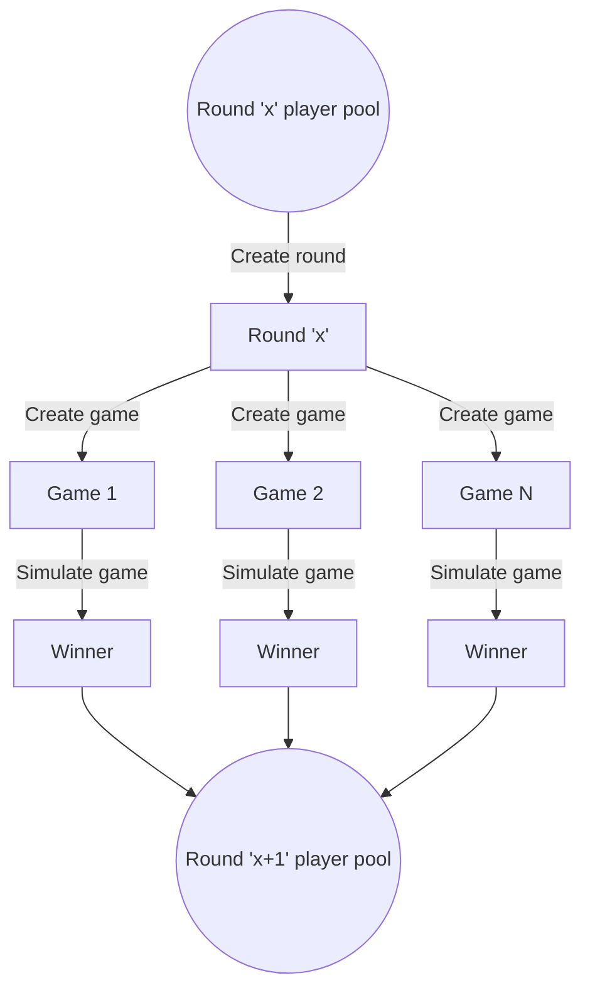

# Brackets

Brackets simulates the progression of a generic tournament bracket.

## Basic concepts

- A **bracket** is created using a specified positive number of players.

- The bracket progresses players through a series of **rounds**, each of which is composed of **games**.

- A game is a competitive simulation between a pair of **players**.

- The winning player from each game is carried forward to the next round; the process repeats until a single player remains.

## Round progression

An example from a generic `Round x` to `Round x + 1` is given here:

1. For a given round, a pool of players is provided as input.

1. The round logic will form games between two players.

1. Each game is then simulated to determine a winner between each pair of players.

1. The winner(s) for the current round are then provided as the pool of players to the next round, if another round is needed.

## Limitations

- The initial number of players supplied to the bracket must be a positive power of 2.
- Only two players can play in a match.
