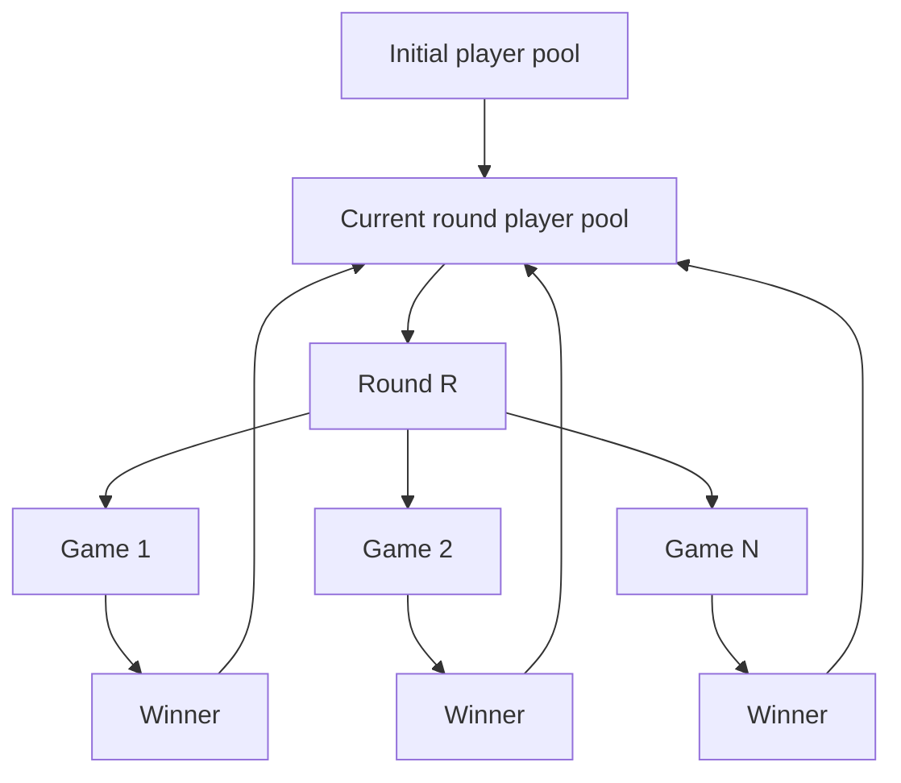

# Brackets

Brackets simulates the progression of a generic tournament bracket.

## Basic concepts

1. A given number of players is used to create a **bracket**.

1. Each bracket consists of one or more **rounds**.

1. Each round consists of one or more **games**.

1. Each game consists of exactly two **players**.

## Algorithm

1. For a given round, a pool of players is provided as input.

1. The round logic will form games between two players.

1. Each game is then simulated to determine a winner between each pair of players.

1. The winner for the current round are then provided as the pool of players to the next round, if another round is needed.

## Limitations

- The initial number of players supplied to the bracket must be a positive power of 2.
- Only two players can play in a match.
